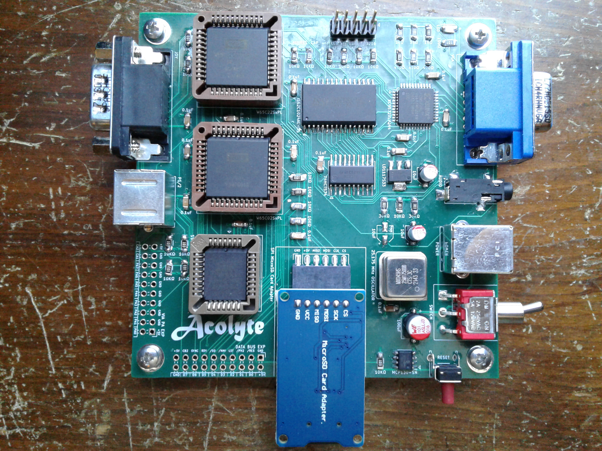

# NewAcolyte

This is the New Acolyte microcomputer.  

It runs a W65C02 microprocessor at 6.29 MHz, and has 64 KB of RAM and 32 KB of ROM available.  It can output 16-colors at a 256x240 resolution, or 4-colors at 512x240 resolution.  It supports PS/2 Keyboard and Mouse, Genesis Gamepad, square wave audio output, and SD Card through SPI adapter.  This New Acolyte uses the Xilinx XC9572XL CLPD, programmed using Xilinx ISE and 'xc3sprog'.  

Currently it's software includes the Scratchpad, Monitor, BASIC, and Tetra game.

(Bodge wire connects V-SYNC to /NMI. Pull-up resistors on JOY-UP, JOY-DOWN, JOY-BUTTON1, and JOY-BUTTON2. Pull-down resistor on ROM-BANK.)

